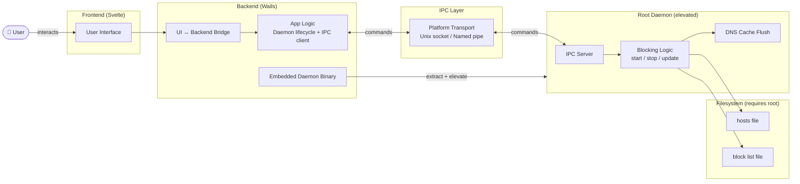
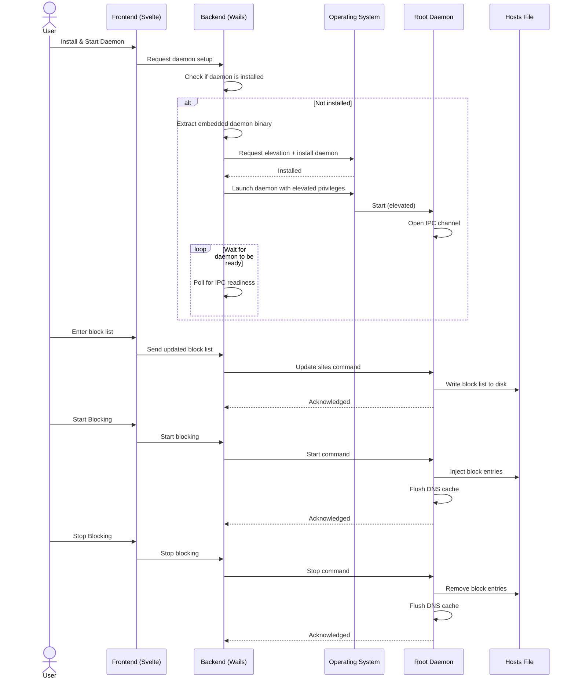

# Free Mind — Architecture Diagrams

## Diagram 1 — System Architecture

```mermaid
graph LR
    User(["👤 User"])

    subgraph Frontend["Frontend (Svelte)"]
        UI["User Interface"]
    end

    subgraph MainApp["Backend (Wails)"]
        Bridge["UI ↔ Backend Bridge"]
        AppLogic["App Logic<br/>Daemon lifecycle + IPC client"]
        EmbeddedBin["Embedded Daemon Binary"]
    end

    subgraph IPC["IPC Layer"]
        Transport["Platform Transport<br/>Unix socket / Named pipe"]
    end

    subgraph Daemon["Root Daemon (elevated)"]
        IPCServer["IPC Server"]
        BlockingLogic["Blocking Logic<br/>start / stop / update"]
        DNS["DNS Cache Flush"]
    end

    subgraph FS["Filesystem (requires root)"]
        Hosts["hosts file"]
        BlockList["block list file"]
    end

    User -->|interacts| UI
    UI --> Bridge --> AppLogic
    AppLogic <-->|commands| Transport
    Transport <-->|commands| IPCServer
    IPCServer --> BlockingLogic
    BlockingLogic --> Hosts
    BlockingLogic --> BlockList
    BlockingLogic --> DNS
    EmbeddedBin -->|"extract + elevate"| Daemon
```

---

## Diagram 2 — Daemon Lifecycle & Blocking Flow

```mermaid
sequenceDiagram
    actor User
    participant UI as Frontend (Svelte)
    participant App as Backend (Wails)
    participant OS as Operating System
    participant Daemon as Root Daemon
    participant Hosts as Hosts File

    User->>UI: Install & Start Daemon
    UI->>App: Request daemon setup
    App->>App: Check if daemon is installed
    alt Not installed
        App->>App: Extract embedded daemon binary
        App->>OS: Request elevation + install daemon
        OS-->>App: Installed
        App->>OS: Launch daemon with elevated privileges
        OS->>Daemon: Start (elevated)
        Daemon->>Daemon: Open IPC channel
        loop Wait for daemon to be ready
            App->>App: Poll for IPC readiness
        end
    end

    User->>UI: Enter block list
    UI->>App: Send updated block list
    App->>Daemon: Update sites command
    Daemon->>Hosts: Write block list to disk
    Daemon-->>App: Acknowledged

    User->>UI: Start Blocking
    UI->>App: Start blocking
    App->>Daemon: Start command
    Daemon->>Hosts: Inject block entries
    Daemon->>Daemon: Flush DNS cache
    Daemon-->>App: Acknowledged

    User->>UI: Stop Blocking
    UI->>App: Stop blocking
    App->>Daemon: Stop command
    Daemon->>Hosts: Remove block entries
    Daemon->>Daemon: Flush DNS cache
    Daemon-->>App: Acknowledged
```
