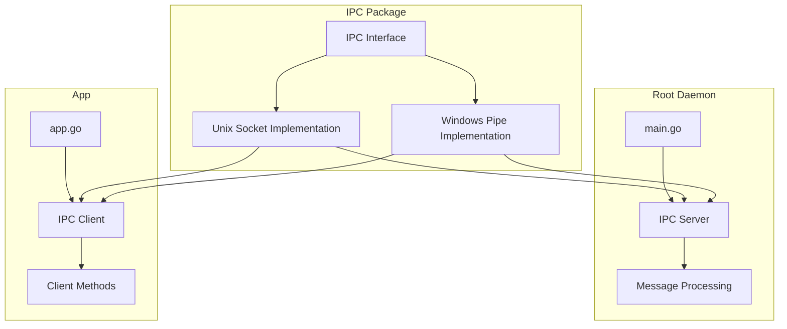

# IPC Implementation Plan

## Overview

This plan outlines the implementation of a new IPC (Inter-Process Communication) package to replace the current ZMQ-based communication between the main application and the root daemon.

## Goals

1. Create a platform-independent IPC interface
2. Implement Unix socket-based IPC for Linux and Darwin
3. Implement Windows named pipe-based IPC for Windows
4. Update the root daemon to use the new IPC package
5. Update the app to use the new IPC client
6. Remove ZMQ dependencies

## Architecture

### IPC Package Structure

```
ipc/
├── ipc.go         # Main interface definition
├── unix.go        # Unix socket implementation for Linux/Darwin
└── windows.go     # Windows named pipe implementation
```

### IPC Interface Design

The IPC interface will define three main components:
- `Server` - For listening and accepting connections
- `Connection` - For handling communication over an established connection
- `Client` - For connecting to a server

### Implementation Details

#### Unix Socket Implementation (Linux/Darwin)
- Use Go's standard `net` package for Unix domain sockets
- Socket path: `/run/tech.tanay.free-mind.sock`
- Implement JSON message serialization/deserialization

#### Windows Named Pipe Implementation
- Use `github.com/Microsoft/go-winio` package for Windows named pipes
- Pipe path: `\\.\pipe\tech.tanay.free-mind`
- Implement JSON message serialization/deserialization

## Integration with Existing Code

### Root Daemon Updates
- Replace ZMQ router with IPC server
- Update message handling to use the new IPC connection
- Keep the same message structure and processing logic
- Update port file handling to socket/pipe path handling

### App Updates
- Replace ZMQ dealer with IPC client
- Update connection logic to use the new IPC client
- Keep the same message structure
- Update port file handling to socket/pipe path handling

## Architecture Diagram



## Implementation Steps

1. Create the IPC package with interfaces for Server, Connection, and Client
2. Implement Unix socket IPC implementation for Linux and Darwin
3. Implement Windows pipe IPC implementation using github.com/Microsoft/go-winio
4. Update root-daemon/main.go to use the new IPC package
5. Update app.go to use the new IPC client
6. Remove ZMQ related code from both files
7. Test the implementation for different platforms